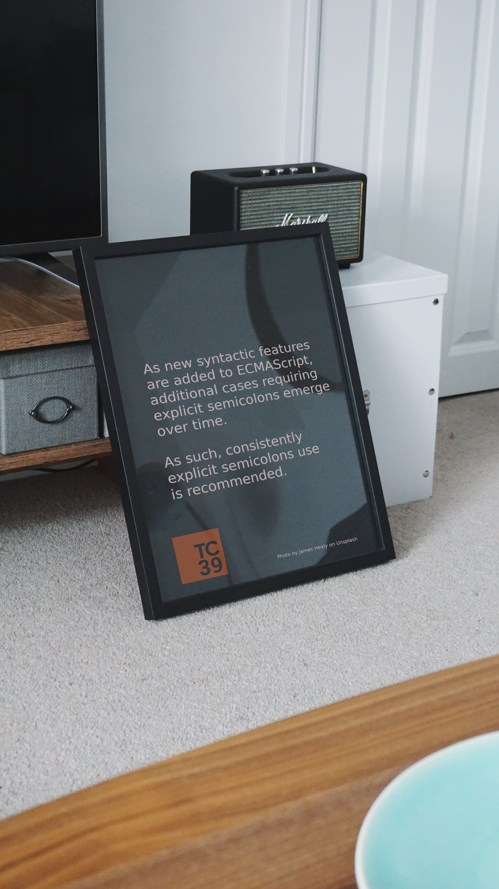

# About no semicolons in JS

Years ago I've written [this open letter](https://medium.com/@WebReflection/an-open-letter-to-javascript-leaders-regarding-no-semicolons-82cec422d67d) regarding no semicolons.

Meanwhile, [semi-standard](https://github.com/standard/semistandard#readme) became more popular, but it's evident to TC39 too that [using automatic semicolon insertion is hazardous](https://github.com/tc39/ecma262/pull/1062).

Since it feels good to be proven right after years of rants regarding a specific issue, I'd just like to [host this repo](https://webreflection.github.io/about-no-semicolons/) showing off my new poster 🎉

- - -

Original Photo by [James Healy](https://unsplash.com/@essentialprints?utm_source=unsplash&utm_medium=referral&utm_content=creditCopyText) on [Unsplash](https://unsplash.com/search/photos/black-poster?utm_source=unsplash&utm_medium=referral&utm_content=creditCopyText)

- - -

